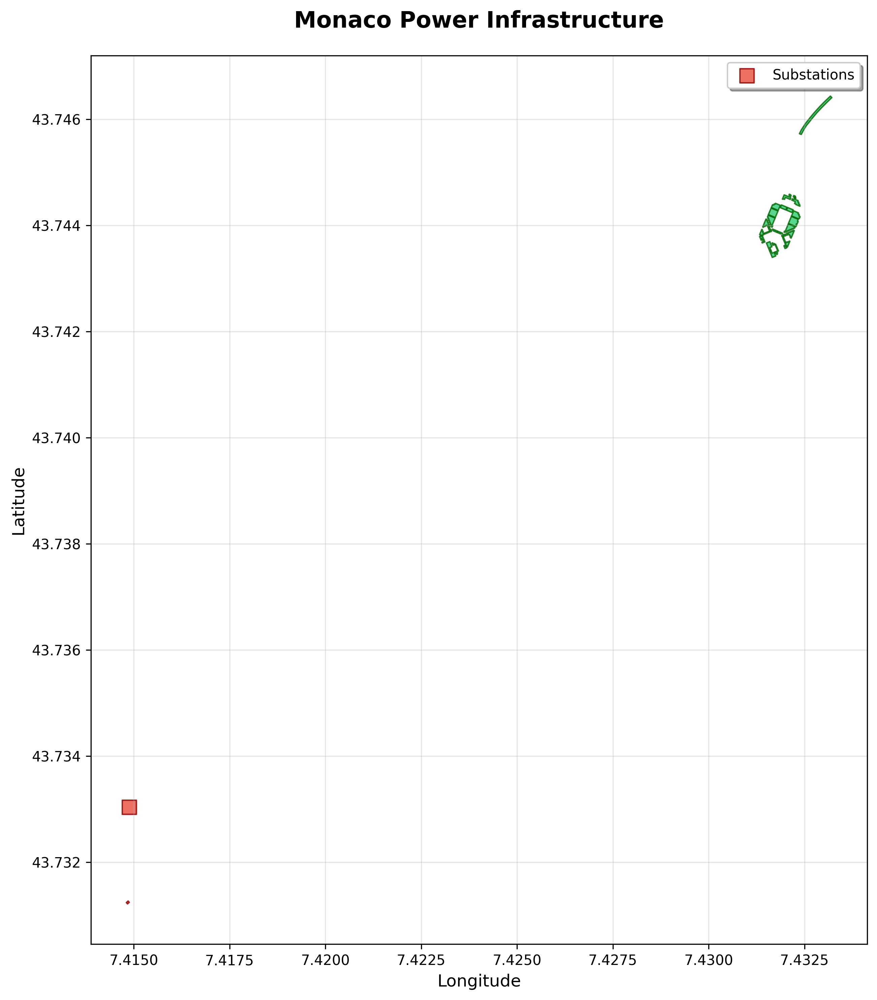
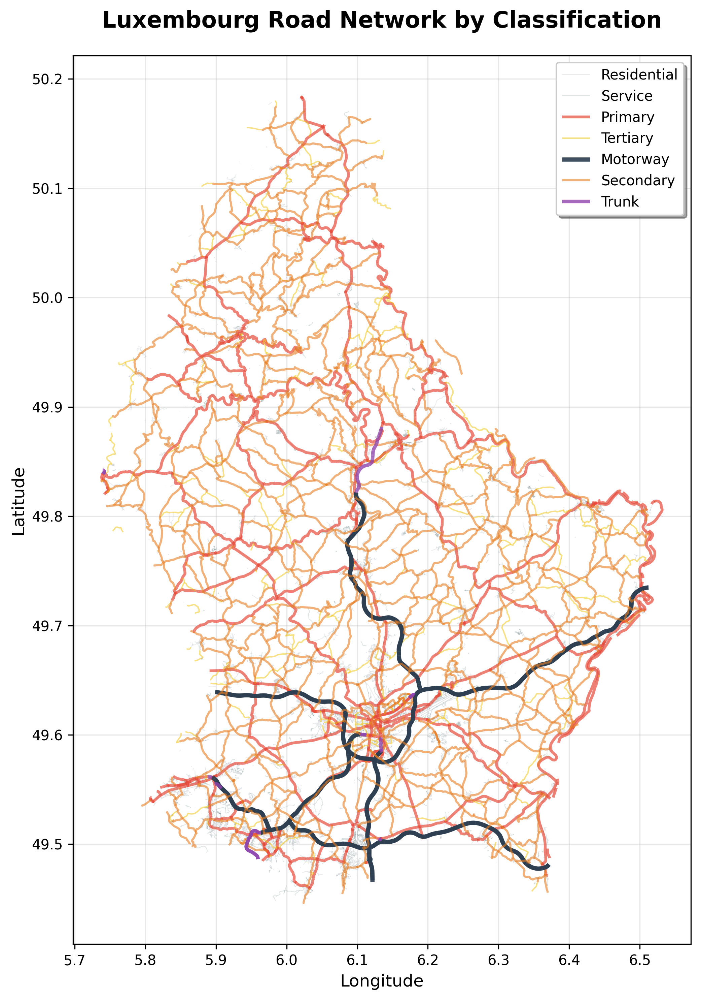
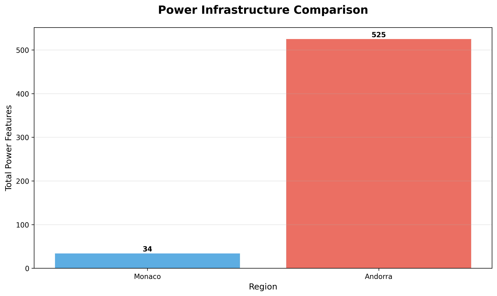

# Earth-OSM Visualization Examples

*Last updated: 2024-10-01*

This section contains comprehensive visualization examples showcasing Earth-OSM's capabilities with real data and plots for various infrastructure types.

## 🎨 Featured Visualizations

### Power Infrastructure Analysis
Comprehensive analysis of electrical infrastructure with real data extraction and visualization.



- **Data Source**: Monaco power infrastructure (OSM)
- **Features**: Substations, generators, power lines
- **Visualization**: Geographic mapping with feature differentiation

### Highway Network Analysis
Multi-class road network visualization showing transportation infrastructure hierarchy.



- **Data Source**: Luxembourg road network (OSM)  
- **Features**: Motorways, trunk roads, primary/secondary roads
- **Visualization**: Color-coded network by road classification

### Statistical Analysis
Data quality and distribution analysis with comprehensive plots.


- **Analysis Type**: Multi-panel statistical visualization
- **Metrics**: Feature distribution, data completeness, infrastructure counts
- **Applications**: Data quality assessment, research analysis

### Regional Comparisons
Cross-regional infrastructure comparison and benchmarking.



- **Regions**: Monaco, Andorra (expandable to any regions)
- **Metric**: Total power infrastructure features
- **Use Case**: Comparative studies, infrastructure density analysis

### Workflow Overview
Understanding the Earth-OSM data extraction and visualization workflow.


- **Process**: 5-step workflow visualization
- **Stages**: Install → Choose → Extract → Analyze → Visualize
- **Application**: Educational, documentation, presentations

## 📊 Available Examples

### Infrastructure Types

| Type | Example Region | Features Covered | Visualization |
|------|---------------|------------------|---------------|
| **Power** | Monaco | Substations, generators, cables | Geographic + statistical plots |
| **Highway** | Luxembourg | All road classifications | Multi-layer network map |
| **Railway** | Switzerland | Rails, stations, signals | Network topology |
| **Comparative** | Multiple | Cross-regional analysis | Bar charts, comparisons |

### Analysis Categories

- **Geographic Visualization**: Maps showing spatial distribution of infrastructure
- **Statistical Analysis**: Data quality, distribution, and completeness metrics  
- **Network Analysis**: Connectivity and topology visualizations
- **Comparative Studies**: Multi-region benchmarking and analysis
- **Temporal Analysis**: Infrastructure development over time (when data available)

## 🔧 Generating Your Own Visualizations

### Quick Start Script

Use our automated visualization generator:

```bash
# Run the quick visualization script
python scripts/quick_visualizations.py
```

This generates:
- ✅ Power infrastructure maps
- ✅ Highway network visualizations  
- ✅ Statistical analysis plots
- ✅ Regional comparison charts
- ✅ Workflow diagrams

### Custom Visualizations

Create your own visualizations:

```python
from earth_osm.eo import save_osm_data
import geopandas as gpd
import matplotlib.pyplot as plt

# 1. Extract data for your region
save_osm_data(
    region_list=['your_region'],
    primary_name='power',  # or 'highway', 'railway', etc.
    out_dir='./your_data'
)

# 2. Load and visualize
gdf = gpd.read_file('./your_data/out/YOUR_REGION_feature.geojson')
gdf.plot(figsize=(12, 8), color='blue', alpha=0.7)
plt.title('Your Infrastructure Analysis')
plt.show()
```

## 🎯 Use Cases and Applications

### Research Applications
- **Academic Studies**: Infrastructure density, coverage analysis
- **Urban Planning**: Transportation network analysis
- **Energy Systems**: Power grid modeling and visualization
- **GIS Analysis**: Spatial analysis and mapping

### Educational Applications  
- **Teaching Materials**: Real-world data examples
- **Workshops**: Hands-on geospatial analysis
- **Documentation**: Step-by-step tutorials with visual results

### Professional Applications
- **Consulting Projects**: Infrastructure assessment
- **Policy Analysis**: Regional infrastructure comparisons
- **Technical Reports**: Data-driven visualizations
- **Presentations**: Professional-quality plots and maps

## 🛠️ Technical Details

### Data Sources
- **OpenStreetMap**: Comprehensive, global infrastructure data
- **GeoFabrik**: Processed regional extracts for fast access
- **Real-time Updates**: Fresh data from OSM community

### Visualization Libraries
- **Matplotlib**: Publication-quality static plots
- **GeoPandas**: Spatial data visualization
- **Seaborn**: Statistical visualization enhancement
- **Plotly**: Interactive plots and dashboards
- **Folium**: Web-based interactive maps

### Generated Outputs
- **High-resolution PNGs**: 300 DPI for publications
- **Interactive HTML maps**: Web-ready visualizations
- **Statistical summaries**: Data quality reports
- **Reproducible code**: Copy-paste examples

## 📈 Automation Features

### Automated Generation
- **Script-based**: One command generates all visualizations
- **Configurable**: Easy to modify regions and infrastructure types
- **Scalable**: Process multiple regions simultaneously
- **Reproducible**: Consistent results across runs

### Documentation Integration
- **Auto-update**: Visualizations refresh with new data
- **Version control**: Track changes in infrastructure over time
- **Cross-references**: Links between code, data, and visualizations

---

*Visualizations generated with Earth-OSM using real OpenStreetMap data*
