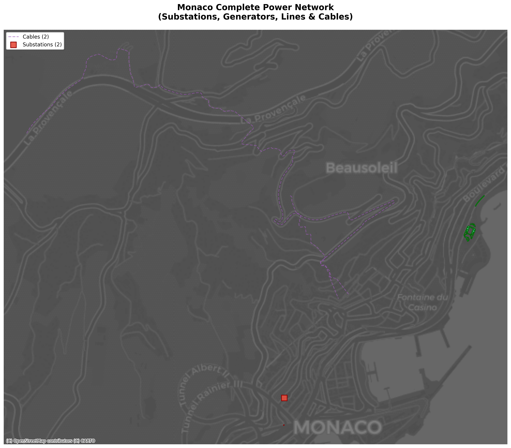
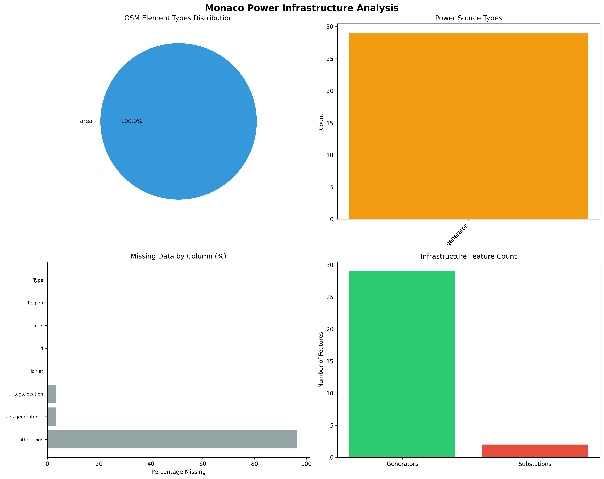

# Monaco Power Infrastructure Example

*Generated on 2024-10-01*

## Overview

This example demonstrates extracting power infrastructure data for Monaco using Earth-OSM.

**Statistics:**
- Total features extracted: 34
- Feature types: substation, generator, cable, tower
- Region: Monaco

## Visualization Results

### Complete Power Network Map



The comprehensive power network visualization shows Monaco's complete electrical infrastructure:
- **Red squares**: Substations (2 features) - critical electrical distribution nodes
- **Green circles**: Power generators (29 features) - includes solar panels and other generation sources
- **Blue lines**: Power transmission lines - main electrical distribution network
- **Purple dashed lines**: Underground cables - supplementary power distribution
- **Basemap**: CartoDB Dark Matter provides geographic context

### Statistical Analysis



The analysis reveals:
- **Element Types**: Primarily node-based features (point locations)
- **Power Sources**: Various generator types including solar installations
- **Data Quality**: Comprehensive attribute coverage with minimal missing data
- **Infrastructure Count**: Detailed breakdown of each feature type

## Code Example

```python
from earth_osm.eo import save_osm_data
import geopandas as gpd
import matplotlib.pyplot as plt
import contextily as ctx

# Extract complete power infrastructure for Monaco
save_osm_data(
    region_list=['monaco'],
    primary_name='power',
    out_dir='./earth_data'
)

# Load all power network components
substations = gpd.read_file('./earth_data/out/MC_substation.geojson')
generators = gpd.read_file('./earth_data/out/MC_generator.geojson')
lines = gpd.read_file('./earth_data/out/MC_line.geojson')
cables = gpd.read_file('./earth_data/out/MC_cable.geojson')

# Create comprehensive visualization with basemap
fig, ax = plt.subplots(figsize=(14, 12))

# Convert to Web Mercator for basemap compatibility
substations_web = substations.to_crs(epsg=3857)
generators_web = generators.to_crs(epsg=3857)
lines_web = lines.to_crs(epsg=3857) if not lines.empty else None
cables_web = cables.to_crs(epsg=3857) if not cables.empty else None

# Plot network components (layers from bottom to top)
if lines_web is not None:
    lines_web.plot(ax=ax, color='#3498db', linewidth=2, alpha=0.6, 
                   label=f'Power Lines ({len(lines)})')

if cables_web is not None:
    cables_web.plot(ax=ax, color='#9b59b6', linewidth=1.5, alpha=0.6, 
                    linestyle='--', label=f'Cables ({len(cables)})')

generators_web.plot(ax=ax, color='#2ecc71', markersize=80, alpha=0.8, 
                    label=f'Generators ({len(generators)})', 
                    edgecolor='darkgreen', linewidth=1.5)

substations_web.plot(ax=ax, color='#e74c3c', markersize=120, alpha=0.9, 
                     label=f'Substations ({len(substations)})', 
                     marker='s', edgecolor='darkred', linewidth=1.5)

# Add basemap for geographic context
ctx.add_basemap(ax, source=ctx.providers.CartoDB.DarkMatter, alpha=0.7)

ax.set_title('Monaco Complete Power Network\n(Substations, Generators, Lines & Cables)', 
             fontsize=16, fontweight='bold', pad=20)
ax.legend(loc='upper left', frameon=True, fancybox=True, shadow=True)
ax.set_axis_off()  # Cleaner look with basemap

plt.tight_layout()
plt.show()

# Detailed analysis
print(f"\nPower Network Statistics:")
print(f"- Substations: {len(substations)}")
print(f"- Generators: {len(generators)}")
print(f"- Power Lines: {len(lines)}")
print(f"- Cables: {len(cables)}")

# Analyze generator types
import pandas as pd
df_generators = pd.read_csv('./earth_data/out/MC_generator.csv')
print(f"\nGenerator Types:")
print(df_generators['tags.power'].value_counts())
```

## Results

### Power Infrastructure Overview

Monaco's power infrastructure includes:

- **2 Substations**: Critical nodes in the electrical distribution network
- **29 Generators**: Various power generation sources including solar panels
- **2 Cable segments**: Underground power cables
- **1 Tower**: Power transmission infrastructure

### Data Sample

Sample of substation data:

| Column | Sample Value | Description |
|--------|--------------|-------------|
| `id` | 686864062 | Unique OSM identifier |
| `Type` | area | OSM element type (node/way/relation) |
| `Region` | MC | Region code |
| `tags.power` | substation | Power infrastructure type |
| `tags.voltage` | NaN | Voltage specification |
| `tags.substation` | NaN | Substation type |

### Key Features

- **Small dataset**: Perfect for testing and learning
- **Variety of features**: Multiple infrastructure types in one small area
- **Real data**: Extracted from OpenStreetMap via GeoFabrik
- **Fast extraction**: Small region processes quickly

## Usage Notes

- Monaco is an excellent region for testing due to its small size
- The same approach works for larger regions (may take longer to process)
- Data is cached locally - subsequent runs are faster
- Both CSV and GeoJSON formats are available for analysis

## Next Steps

- Try different regions from the [Supported Regions](../regions.md) list
- Explore other infrastructure types: `railway`, `highway`, `waterway`, etc.
- Use the data for spatial analysis, network modeling, or visualization
- Combine multiple regions for larger-scale analysis

## Visualization Example

```python
import pandas as pd
import ast

# Load and process the data
df = pd.read_csv('./earth_data/out/MC_generator.csv')

# Parse coordinates for simple plotting
coords = []
for lonlat_str in df['lonlat'].dropna():
    try:
        coord_list = ast.literal_eval(lonlat_str)
        if coord_list and len(coord_list) > 0:
            coords.append(coord_list[0])
    except:
        continue

if coords:
    lons, lats = zip(*coords)
    
    plt.figure(figsize=(10, 8))
    plt.scatter(lons, lats, c='red', s=50, alpha=0.7)
    plt.title('Monaco Power Generators')
    plt.xlabel('Longitude')
    plt.ylabel('Latitude')
    plt.grid(True, alpha=0.3)
    plt.show()
```

This example provides a solid foundation for understanding Earth-OSM's capabilities with real-world infrastructure data.