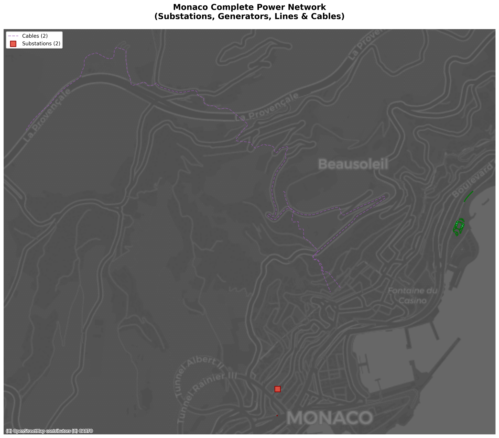

# Visualization with Earth-OSM

This guide shows how to create compelling visualizations of infrastructure data extracted with Earth-OSM, with real examples and plots.

## Setup

First, install the required visualization libraries:

```bash
pip install matplotlib plotly seaborn folium contextily
```

## Earth-OSM Workflow

Understanding the Earth-OSM workflow helps you plan your visualization approach:


## Real Infrastructure Visualizations

Let's explore actual infrastructure data with visualizations.

### Power Infrastructure Analysis

Here's a complete example using Monaco's power infrastructure:

```python
from earth_osm.eo import save_osm_data
import geopandas as gpd
import matplotlib.pyplot as plt

# Extract power infrastructure for Monaco
save_osm_data(
    region_list=['monaco'],
    primary_name='power',
    out_dir='./earth_data'
)

# Load the data
substations = gpd.read_file('./earth_data/out/MC_substation.geojson')
generators = gpd.read_file('./earth_data/out/MC_generator.geojson')

# Create visualization
fig, ax = plt.subplots(figsize=(12, 10))

# Plot generators as green circles
generators.plot(ax=ax, color='#2ecc71', markersize=60, alpha=0.8, 
                label='Generators', edgecolor='darkgreen')

# Plot substations as red squares  
substations.plot(ax=ax, color='#e74c3c', markersize=100, alpha=0.8, 
                 label='Substations', marker='s', edgecolor='darkred')

ax.set_title('Monaco Power Infrastructure', fontsize=16, fontweight='bold')
ax.set_xlabel('Longitude')
ax.set_ylabel('Latitude')
ax.legend()
ax.grid(True, alpha=0.3)
plt.show()
```

**Result:**



*This comprehensive visualization shows Monaco's complete electrical infrastructure: substations (red squares), generators (green circles), power lines (blue), and cables (purple), all overlaid on a geographic basemap for real-world context.*

### Statistical Analysis

Create comprehensive analysis plots:

```python
import pandas as pd
import seaborn as sns

# Load CSV data for analysis
df_power = pd.read_csv('./earth_data/out/MC_generator.csv')

# Create multi-panel analysis
fig, axes = plt.subplots(2, 2, figsize=(15, 12))
fig.suptitle('Monaco Power Infrastructure Analysis', fontsize=16)

# Element type distribution
type_counts = df_power['Type'].value_counts()
axes[0, 0].pie(type_counts.values, labels=type_counts.index, autopct='%1.1f%%')
axes[0, 0].set_title('OSM Element Types')

# Power source types
power_types = df_power['tags.power'].value_counts().head(5)
axes[0, 1].bar(range(len(power_types)), power_types.values)
axes[0, 1].set_title('Power Source Types')

# Data completeness analysis
completeness = (df_power.isnull().sum() / len(df_power) * 100)
top_missing = completeness.head(8)
axes[1, 0].barh(range(len(top_missing)), top_missing.values)
axes[1, 0].set_title('Missing Data by Column (%)')

# Feature counts
feature_counts = {'Generators': len(generators), 'Substations': len(substations)}
axes[1, 1].bar(feature_counts.keys(), feature_counts.values())
axes[1, 1].set_title('Infrastructure Feature Count')

plt.tight_layout()
plt.show()
```

**Result:**


### Highway Network Visualization

Visualize road networks with different classifications:

```python
# Extract highway data for Luxembourg
save_osm_data(
    region_list=['luxembourg'],
    primary_name='highway',
    out_dir='./highway_data'
)

# Load different road types
road_types = ['motorway', 'trunk', 'primary', 'secondary', 'tertiary', 'residential']
colors = ['#2c3e50', '#8e44ad', '#e74c3c', '#e67e22', '#f1c40f', '#bdc3c7']

fig, ax = plt.subplots(figsize=(14, 10))

# Plot roads in order of importance (least important first)
for road_type, color in zip(reversed(road_types), reversed(colors)):
    try:
        gdf = gpd.read_file(f'./highway_data/out/LU_{road_type}.geojson')
        if len(gdf) > 0:
            linewidth = 3 if road_type in ['motorway', 'trunk'] else 2 if road_type == 'primary' else 1
            gdf.plot(ax=ax, color=color, linewidth=linewidth, alpha=0.8, label=road_type.title())
    except FileNotFoundError:
        continue

ax.set_title('Luxembourg Road Network by Classification', fontsize=16, fontweight='bold')
ax.legend(loc='best')
ax.grid(True, alpha=0.3)
plt.show()
```

**Result:**


*Luxembourg's complete road network showing the hierarchy from motorways (dark red) to residential streets (gray), displayed over an OpenStreetMap base layer for geographic context.*

### Network Topology Analysis

Analyze power grid topology and connectivity:

```python
import networkx as nx

# Extract power network data
save_osm_data(
    region_list=['luxembourg'],
    primary_name='power',
    out_dir='./power_network'
)

# Load substations and lines
substations = gpd.read_file('./power_network/out/LU_substation.geojson')
lines = gpd.read_file('./power_network/out/LU_line.geojson')

# Create network graph
G = nx.Graph()

# Add substations as nodes
for idx, row in substations.iterrows():
    G.add_node(row['id'], pos=(row.geometry.x, row.geometry.y))

# Analyze network properties
print(f"Network Statistics:")
print(f"- Nodes (Substations): {G.number_of_nodes()}")
print(f"- Network Density: {nx.density(G):.3f}")
print(f"- Connected Components: {nx.number_connected_components(G)}")

# Visualize network
fig, (ax1, ax2) = plt.subplots(1, 2, figsize=(20, 10))

# Geographic layout
pos = nx.get_node_attributes(G, 'pos')
nx.draw_networkx_nodes(G, pos, ax=ax1, node_color='red', node_size=100, alpha=0.8)
nx.draw_networkx_edges(G, pos, ax=ax1, edge_color='blue', width=1, alpha=0.6)
ax1.set_title('Power Network (Geographic)')
ax1.set_xlabel('Longitude')
ax1.set_ylabel('Latitude')

# Force-directed layout
spring_pos = nx.spring_layout(G, k=1, iterations=50)
nx.draw_networkx(G, spring_pos, ax=ax2, node_color='red', node_size=50, 
                 with_labels=False, edge_color='blue', width=0.5, alpha=0.7)
ax2.set_title('Power Network (Force-Directed)')

plt.tight_layout()
plt.show()
```

*Network analysis helps identify critical infrastructure nodes, connectivity patterns, and potential vulnerabilities in power grids.*

# Plot power lines
lines.plot(ax=ax, color='red', linewidth=0.5, alpha=0.7, label='Power Lines')

# Plot substations with different colors by voltage
if 'voltage' in substations.columns:
    substations.plot(ax=ax, column='voltage', cmap='viridis', 
                    markersize=20, alpha=0.8, legend=True, label='Substations')
else:
    substations.plot(ax=ax, color='blue', markersize=20, alpha=0.8, label='Substations')

ax.set_title('Netherlands Power Infrastructure', fontsize=16, fontweight='bold')
ax.legend()
plt.tight_layout()
plt.show()
```

### Enhanced Map with Context

```python
import contextily as ctx
import geopandas as gpd
import matplotlib.pyplot as plt

def plot_infrastructure_with_basemap(region, infrastructure_type):
    """Create an enhanced map with basemap context."""
    
    # Load data
    region_code = region.upper()[:2]
    gdf = gpd.read_file(f'./earth_data/out/{region_code}_{infrastructure_type}.geojson')
    
    # Convert to Web Mercator for basemap compatibility
    gdf_web = gdf.to_crs(epsg=3857)
    
    fig, ax = plt.subplots(figsize=(15, 12))
    
    # Plot infrastructure
    if infrastructure_type == 'substation':
        gdf_web.plot(ax=ax, color='red', markersize=30, alpha=0.8, edgecolor='darkred')
    elif infrastructure_type == 'line':
        gdf_web.plot(ax=ax, color='blue', linewidth=2, alpha=0.7)
    else:
        gdf_web.plot(ax=ax, alpha=0.7)
    
    # Add basemap
    ctx.add_basemap(ax, crs=gdf_web.crs, source=ctx.providers.CartoDB.Positron)
    
    ax.set_title(f'{region.title()} {infrastructure_type.title()} Infrastructure', 
                fontsize=16, fontweight='bold')
    ax.set_axis_off()
    
    plt.tight_layout()
    plt.show()

# Create enhanced maps
plot_infrastructure_with_basemap('netherlands', 'substation')
```

## Interactive Maps with Folium

### Basic Interactive Map

```python
import folium
import geopandas as gpd
import pandas as pd
from folium.plugins import MarkerCluster

def create_interactive_map(region, infrastructure_type):
    """Create an interactive map using Folium."""
    
    # Load data
    region_code = region.upper()[:2]
    gdf = gpd.read_file(f'./earth_data/out/{region_code}_{infrastructure_type}.geojson')
    
    # Calculate map center
    bounds = gdf.total_bounds
    center_lat = (bounds[1] + bounds[3]) / 2
    center_lon = (bounds[0] + bounds[2]) / 2
    
    # Create base map
    m = folium.Map(
        location=[center_lat, center_lon],
        zoom_start=8,
        tiles='OpenStreetMap'
    )
    
    # Add marker cluster for points
    if infrastructure_type in ['substation', 'generator']:
        marker_cluster = MarkerCluster().add_to(m)
        
        for idx, row in gdf.iterrows():
            if row.geometry.geom_type == 'Point':
                folium.Marker(
                    location=[row.geometry.y, row.geometry.x],
                    popup=f"ID: {row.get('id', 'N/A')}<br>Type: {infrastructure_type}",
                    icon=folium.Icon(color='red' if infrastructure_type == 'substation' else 'blue')
                ).add_to(marker_cluster)
    
    # Add lines
    elif infrastructure_type == 'line':
        for idx, row in gdf.iterrows():
            if row.geometry.geom_type in ['LineString', 'MultiLineString']:
                coords = []
                if row.geometry.geom_type == 'LineString':
                    coords = [[point[1], point[0]] for point in row.geometry.coords]
                else:
                    for line in row.geometry.geoms:
                        coords.extend([[point[1], point[0]] for point in line.coords])
                
                folium.PolyLine(
                    locations=coords,
                    color='red',
                    weight=2,
                    opacity=0.8,
                    popup=f"ID: {row.get('id', 'N/A')}"
                ).add_to(m)
    
    return m

# Create interactive map
map_obj = create_interactive_map('netherlands', 'substation')
map_obj.save('netherlands_substations.html')
print("Interactive map saved as 'netherlands_substations.html'")
```

### Multi-layer Interactive Map

```python
import folium
from folium.plugins import MarkerCluster
import geopandas as gpd

def create_multilayer_map(region):
    """Create a multi-layer interactive map."""
    
    region_code = region.upper()[:2]
    
    # Load different infrastructure types
    data_layers = {}
    for infra_type in ['substation', 'line', 'generator']:
        try:
            gdf = gpd.read_file(f'./earth_data/out/{region_code}_{infra_type}.geojson')
            data_layers[infra_type] = gdf
        except FileNotFoundError:
            continue
    
    if not data_layers:
        print("No data found!")
        return None
    
    # Calculate map center from all data
    all_bounds = []
    for gdf in data_layers.values():
        all_bounds.append(gdf.total_bounds)
    
    combined_bounds = pd.DataFrame(all_bounds).agg(['min', 'max'])
    center_lat = (combined_bounds.loc['min', 1] + combined_bounds.loc['max', 3]) / 2
    center_lon = (combined_bounds.loc['min', 0] + combined_bounds.loc['max', 2]) / 2
    
    # Create map
    m = folium.Map(
        location=[center_lat, center_lon],
        zoom_start=8,
        tiles='OpenStreetMap'
    )
    
    # Add layer control
    layer_control = True
    
    # Colors for different infrastructure types
    colors = {'substation': 'red', 'line': 'blue', 'generator': 'green'}
    
    for infra_type, gdf in data_layers.items():
        feature_group = folium.FeatureGroup(name=infra_type.title())
        
        if infra_type in ['substation', 'generator']:
            # Add markers
            for idx, row in gdf.iterrows():
                if row.geometry.geom_type == 'Point':
                    popup_text = f"<b>{infra_type.title()}</b><br>"
                    popup_text += f"ID: {row.get('id', 'N/A')}<br>"
                    
                    # Add relevant attributes
                    if hasattr(row, 'voltage') and pd.notna(row.voltage):
                        popup_text += f"Voltage: {row.voltage}<br>"
                    if hasattr(row, 'power') and pd.notna(row.power):
                        popup_text += f"Power: {row.power}<br>"
                    
                    folium.Marker(
                        location=[row.geometry.y, row.geometry.x],
                        popup=folium.Popup(popup_text, max_width=200),
                        icon=folium.Icon(color=colors.get(infra_type, 'blue'))
                    ).add_to(feature_group)
        
        elif infra_type == 'line':
            # Add lines
            for idx, row in gdf.iterrows():
                if row.geometry.geom_type in ['LineString', 'MultiLineString']:
                    coords = []
                    if row.geometry.geom_type == 'LineString':
                        coords = [[point[1], point[0]] for point in row.geometry.coords]
                    
                    popup_text = f"<b>Power Line</b><br>ID: {row.get('id', 'N/A')}"
                    if hasattr(row, 'voltage') and pd.notna(row.voltage):
                        popup_text += f"<br>Voltage: {row.voltage}"
                    
                    folium.PolyLine(
                        locations=coords,
                        color=colors.get(infra_type, 'blue'),
                        weight=3,
                        opacity=0.7,
                        popup=folium.Popup(popup_text, max_width=200)
                    ).add_to(feature_group)
        
        feature_group.add_to(m)
    
    # Add layer control
    folium.LayerControl().add_to(m)
    
    return m

# Create multi-layer map
multi_map = create_multilayer_map('netherlands')
if multi_map:
    multi_map.save('netherlands_power_infrastructure.html')
    print("Multi-layer map saved as 'netherlands_power_infrastructure.html'")
```

## Statistical Visualizations

### Infrastructure Distribution Analysis

```python
import matplotlib.pyplot as plt
import seaborn as sns
import pandas as pd
import numpy as np

def analyze_infrastructure_distribution(region, infrastructure_type):
    """Create statistical visualizations of infrastructure distribution."""
    
    # Load data
    region_code = region.upper()[:2]
    df = pd.read_csv(f'./earth_data/out/{region_code}_{infrastructure_type}.csv')
    
    fig, axes = plt.subplots(2, 2, figsize=(15, 12))
    fig.suptitle(f'{region.title()} {infrastructure_type.title()} Analysis', fontsize=16)
    
    # 1. Feature type distribution
    if 'Type' in df.columns:
        type_counts = df['Type'].value_counts()
        axes[0, 0].pie(type_counts.values, labels=type_counts.index, autopct='%1.1f%%')
        axes[0, 0].set_title('Distribution by OSM Type')
    
    # 2. Voltage distribution (if available)
    if f'tags.{infrastructure_type}' in df.columns:
        subtype_counts = df[f'tags.{infrastructure_type}'].value_counts().head(10)
        axes[0, 1].bar(range(len(subtype_counts)), subtype_counts.values)
        axes[0, 1].set_xticks(range(len(subtype_counts)))
        axes[0, 1].set_xticklabels(subtype_counts.index, rotation=45, ha='right')
        axes[0, 1].set_title(f'Top {infrastructure_type.title()} Types')
        axes[0, 1].set_ylabel('Count')
    
    # 3. Voltage levels (if available)
    if 'tags.voltage' in df.columns:
        voltage_data = pd.to_numeric(df['tags.voltage'], errors='coerce').dropna()
        if len(voltage_data) > 0:
            axes[1, 0].hist(voltage_data, bins=20, alpha=0.7, edgecolor='black')
            axes[1, 0].set_title('Voltage Distribution')
            axes[1, 0].set_xlabel('Voltage')
            axes[1, 0].set_ylabel('Count')
    
    # 4. Feature count over time (creation year if available)
    if 'tags.start_date' in df.columns:
        dates = pd.to_datetime(df['tags.start_date'], errors='coerce')
        years = dates.dt.year.dropna()
        if len(years) > 0:
            year_counts = years.value_counts().sort_index()
            axes[1, 1].plot(year_counts.index, year_counts.values, marker='o')
            axes[1, 1].set_title('Infrastructure Development Over Time')
            axes[1, 1].set_xlabel('Year')
            axes[1, 1].set_ylabel('New Features')
    else:
        # Alternative: show data completeness
        completeness = df.isnull().sum().sort_values(ascending=False).head(10)
        axes[1, 1].barh(range(len(completeness)), completeness.values)
        axes[1, 1].set_yticks(range(len(completeness)))
        axes[1, 1].set_yticklabels(completeness.index)
        axes[1, 1].set_title('Missing Data by Column')
        axes[1, 1].set_xlabel('Missing Values Count')
    
    plt.tight_layout()
    plt.show()
    
    return df

# Analyze substations
df = analyze_infrastructure_distribution('netherlands', 'substation')
```

### Comparative Analysis

```python
import matplotlib.pyplot as plt
import seaborn as sns
import pandas as pd

def compare_regions(regions, infrastructure_type):
    """Compare infrastructure across multiple regions."""
    
    comparison_data = []
    
    for region in regions:
        try:
            region_code = region.upper()[:2]
            df = pd.read_csv(f'./earth_data/out/{region_code}_{infrastructure_type}.csv')
            
            stats = {
                'region': region,
                'total_features': len(df),
                'node_features': sum(df['Type'] == 'node'),
                'way_features': sum(df['Type'] == 'way'),
                'area_features': sum(df['Type'] == 'area'),
            }
            
            # Add voltage statistics if available
            if 'tags.voltage' in df.columns:
                voltage_data = pd.to_numeric(df['tags.voltage'], errors='coerce').dropna()
                stats['avg_voltage'] = voltage_data.mean()
                stats['max_voltage'] = voltage_data.max()
            
            comparison_data.append(stats)
            
        except FileNotFoundError:
            print(f"Data not found for {region}")
    
    if not comparison_data:
        return None
    
    comp_df = pd.DataFrame(comparison_data)
    
    # Create comparison plots
    fig, axes = plt.subplots(2, 2, figsize=(15, 10))
    fig.suptitle(f'{infrastructure_type.title()} Comparison Across Regions', fontsize=16)
    
    # Total features comparison
    axes[0, 0].bar(comp_df['region'], comp_df['total_features'])
    axes[0, 0].set_title('Total Features by Region')
    axes[0, 0].set_ylabel('Count')
    axes[0, 0].tick_params(axis='x', rotation=45)
    
    # Feature type distribution
    feature_types = ['node_features', 'way_features', 'area_features']
    bottom = np.zeros(len(comp_df))
    
    colors = ['skyblue', 'lightcoral', 'lightgreen']
    for i, ftype in enumerate(feature_types):
        if ftype in comp_df.columns:
            axes[0, 1].bar(comp_df['region'], comp_df[ftype], 
                          bottom=bottom, label=ftype.replace('_', ' ').title(),
                          color=colors[i])
            bottom += comp_df[ftype]
    
    axes[0, 1].set_title('Feature Types Distribution')
    axes[0, 1].set_ylabel('Count')
    axes[0, 1].legend()
    axes[0, 1].tick_params(axis='x', rotation=45)
    
    # Voltage comparison (if available)
    if 'avg_voltage' in comp_df.columns:
        axes[1, 0].bar(comp_df['region'], comp_df['avg_voltage'])
        axes[1, 0].set_title('Average Voltage by Region')
        axes[1, 0].set_ylabel('Voltage')
        axes[1, 0].tick_params(axis='x', rotation=45)
    
    # Feature density (features per area - approximate)
    # Note: This is a simplified calculation
    if len(comp_df) > 1:
        axes[1, 1].scatter(comp_df['total_features'], comp_df.index)
        axes[1, 1].set_xlabel('Total Features')
        axes[1, 1].set_ylabel('Region Index')
        axes[1, 1].set_title('Feature Distribution')
        
        for i, region in enumerate(comp_df['region']):
            axes[1, 1].annotate(region, 
                              (comp_df.iloc[i]['total_features'], i),
                              xytext=(5, 0), textcoords='offset points')
    
    plt.tight_layout()
    plt.show()
    
    return comp_df

# Compare multiple regions
regions = ['netherlands', 'belgium', 'denmark', 'luxembourg']
comparison_df = compare_regions(regions, 'substation')
```

## Interactive Dashboards with Plotly

### Dynamic Infrastructure Dashboard

```python
import plotly.graph_objects as go
import plotly.express as px
from plotly.subplots import make_subplots
import pandas as pd
import geopandas as gpd

def create_infrastructure_dashboard(region, infrastructure_type):
    """Create an interactive dashboard using Plotly."""
    
    # Load data
    region_code = region.upper()[:2]
    df = pd.read_csv(f'./earth_data/out/{region_code}_{infrastructure_type}.csv')
    
    # Create subplots
    fig = make_subplots(
        rows=2, cols=2,
        subplot_titles=('Feature Type Distribution', 'Voltage Levels', 
                       'Geographic Distribution', 'Data Completeness'),
        specs=[[{"type": "pie"}, {"type": "histogram"}],
               [{"type": "scatter"}, {"type": "bar"}]]
    )
    
    # 1. Feature type pie chart
    if 'Type' in df.columns:
        type_counts = df['Type'].value_counts()
        fig.add_trace(
            go.Pie(labels=type_counts.index, values=type_counts.values, name="Types"),
            row=1, col=1
        )
    
    # 2. Voltage histogram
    if 'tags.voltage' in df.columns:
        voltage_data = pd.to_numeric(df['tags.voltage'], errors='coerce').dropna()
        fig.add_trace(
            go.Histogram(x=voltage_data, name="Voltage Distribution"),
            row=1, col=2
        )
    
    # 3. Geographic scatter (if coordinate data available)
    if 'lonlat' in df.columns:
        # Parse coordinates (simplified)
        coords = []
        for lonlat_str in df['lonlat'].dropna():
            try:
                import ast
                coord_list = ast.literal_eval(lonlat_str)
                if coord_list and len(coord_list) > 0:
                    coords.append(coord_list[0])  # Take first coordinate
            except:
                continue
        
        if coords:
            lons, lats = zip(*coords)
            fig.add_trace(
                go.Scatter(x=lons, y=lats, mode='markers', 
                          name="Geographic Distribution"),
                row=2, col=1
            )
    
    # 4. Data completeness
    completeness = (df.isnull().sum() / len(df) * 100).sort_values(ascending=True).tail(10)
    fig.add_trace(
        go.Bar(x=completeness.values, y=completeness.index, 
               orientation='h', name="Completeness %"),
        row=2, col=2
    )
    
    # Update layout
    fig.update_layout(
        title_text=f"{region.title()} {infrastructure_type.title()} Dashboard",
        showlegend=False,
        height=800
    )
    
    return fig

# Create dashboard
dashboard = create_infrastructure_dashboard('netherlands', 'substation')
dashboard.show()
```

## Advanced Visualizations

### Network Analysis Visualization

```python
import networkx as nx
import matplotlib.pyplot as plt
import geopandas as gpd
import pandas as pd
from shapely.geometry import Point, LineString

def visualize_power_network(region):
    """Visualize power infrastructure as a network graph."""
    
    region_code = region.upper()[:2]
    
    # Load substations and lines
    try:
        substations = gpd.read_file(f'./earth_data/out/{region_code}_substation.geojson')
        lines = gpd.read_file(f'./earth_data/out/{region_code}_line.geojson')
    except FileNotFoundError:
        print("Required data files not found")
        return
    
    # Create network graph
    G = nx.Graph()
    
    # Add substations as nodes
    for idx, row in substations.iterrows():
        if row.geometry.geom_type == 'Point':
            G.add_node(row['id'], 
                      pos=(row.geometry.x, row.geometry.y),
                      voltage=row.get('voltage', 'Unknown'),
                      substation_type=row.get('substation', 'Unknown'))
    
    # Add lines as edges (simplified - would need more complex logic for real connections)
    for idx, row in lines.iterrows():
        if row.geometry.geom_type == 'LineString':
            coords = list(row.geometry.coords)
            # This is a simplified approach - in reality, you'd need to match
            # line endpoints to nearby substations
            if len(coords) >= 2:
                start_point = Point(coords[0])
                end_point = Point(coords[-1])
                
                # Find closest substations (simplified)
                start_station = None
                end_station = None
                min_start_dist = float('inf')
                min_end_dist = float('inf')
                
                for station_id, station_data in G.nodes(data=True):
                    station_point = Point(station_data['pos'])
                    start_dist = start_point.distance(station_point)
                    end_dist = end_point.distance(station_point)
                    
                    if start_dist < min_start_dist and start_dist < 0.01:  # 0.01 degree threshold
                        min_start_dist = start_dist
                        start_station = station_id
                    
                    if end_dist < min_end_dist and end_dist < 0.01:
                        min_end_dist = end_dist
                        end_station = station_id
                
                if start_station and end_station and start_station != end_station:
                    G.add_edge(start_station, end_station, 
                              voltage=row.get('voltage', 'Unknown'))
    
    # Visualize network
    fig, (ax1, ax2) = plt.subplots(1, 2, figsize=(20, 10))
    
    # Geographic layout
    pos = nx.get_node_attributes(G, 'pos')
    
    # Draw network on geographic coordinates
    nx.draw_networkx_nodes(G, pos, ax=ax1, node_color='red', 
                          node_size=100, alpha=0.8)
    nx.draw_networkx_edges(G, pos, ax=ax1, edge_color='blue', 
                          width=1, alpha=0.6)
    ax1.set_title(f'{region.title()} Power Network (Geographic)')
    ax1.set_xlabel('Longitude')
    ax1.set_ylabel('Latitude')
    
    # Force-directed layout
    if len(G.nodes()) > 0:
        spring_pos = nx.spring_layout(G, k=1, iterations=50)
        nx.draw_networkx_nodes(G, spring_pos, ax=ax2, node_color='red', 
                              node_size=100, alpha=0.8)
        nx.draw_networkx_edges(G, spring_pos, ax=ax2, edge_color='blue', 
                              width=1, alpha=0.6)
        ax2.set_title(f'{region.title()} Power Network (Force-Directed)')
    
    plt.tight_layout()
    plt.show()
    
    # Print network statistics
    print(f"Network Statistics for {region.title()}:")
    print(f"- Nodes (Substations): {G.number_of_nodes()}")
    print(f"- Edges (Connections): {G.number_of_edges()}")
    print(f"- Connected Components: {nx.number_connected_components(G)}")
    
    if G.number_of_nodes() > 0:
        print(f"- Average Degree: {sum(dict(G.degree()).values()) / G.number_of_nodes():.2f}")

# Visualize power network
visualize_power_network('netherlands')
```

### Temporal Analysis Visualization

```python
import matplotlib.pyplot as plt
import pandas as pd
import seaborn as sns
from datetime import datetime, timedelta

def visualize_temporal_patterns(region, infrastructure_type):
    """Visualize temporal patterns in infrastructure data."""
    
    region_code = region.upper()[:2]
    df = pd.read_csv(f'./earth_data/out/{region_code}_{infrastructure_type}.csv')
    
    fig, axes = plt.subplots(2, 2, figsize=(15, 10))
    fig.suptitle(f'{region.title()} {infrastructure_type.title()} Temporal Analysis', fontsize=16)
    
    # 1. Construction timeline (if start_date available)
    if 'tags.start_date' in df.columns:
        dates = pd.to_datetime(df['tags.start_date'], errors='coerce').dropna()
        if len(dates) > 0:
            years = dates.dt.year
            year_counts = years.value_counts().sort_index()
            
            axes[0, 0].plot(year_counts.index, year_counts.values, marker='o', linewidth=2)
            axes[0, 0].set_title('Infrastructure Development Timeline')
            axes[0, 0].set_xlabel('Year')
            axes[0, 0].set_ylabel('New Infrastructure Count')
            axes[0, 0].grid(True, alpha=0.3)
    
    # 2. Data modification timeline (if available)
    # This would require OSM change history data
    
    # 3. Seasonal patterns (simulated - would need actual temporal data)
    # Create example seasonal data
    months = list(range(1, 13))
    seasonal_data = [len(df) * (0.8 + 0.4 * np.sin(m * np.pi / 6)) / 12 for m in months]
    
    axes[0, 1].bar(months, seasonal_data, alpha=0.7)
    axes[0, 1].set_title('Simulated Seasonal Activity Pattern')
    axes[0, 1].set_xlabel('Month')
    axes[0, 1].set_ylabel('Activity Level')
    axes[0, 1].set_xticks(months)
    
    # 4. Age distribution (if start dates available)
    if 'tags.start_date' in df.columns:
        dates = pd.to_datetime(df['tags.start_date'], errors='coerce').dropna()
        if len(dates) > 0:
            current_year = datetime.now().year
            ages = current_year - dates.dt.year
            
            axes[1, 0].hist(ages, bins=20, alpha=0.7, edgecolor='black')
            axes[1, 0].set_title('Infrastructure Age Distribution')
            axes[1, 0].set_xlabel('Age (Years)')
            axes[1, 0].set_ylabel('Count')
    
    # 5. Data completeness over time
    # This is a placeholder - would need actual data history
    years = list(range(2010, 2024))
    completeness = [min(100, 20 + i * 5) for i in range(len(years))]
    
    axes[1, 1].plot(years, completeness, marker='s', linewidth=2, color='green')
    axes[1, 1].set_title('Data Completeness Over Time (Simulated)')
    axes[1, 1].set_xlabel('Year')
    axes[1, 1].set_ylabel('Completeness %')
    axes[1, 1].set_ylim(0, 100)
    axes[1, 1].grid(True, alpha=0.3)
    
    plt.tight_layout()
    plt.show()

# Visualize temporal patterns
visualize_temporal_patterns('netherlands', 'substation')
```

## Automated Visualization Scripts

### Batch Visualization Generator

```python
import os
import matplotlib.pyplot as plt
import geopandas as gpd
from pathlib import Path

def generate_regional_visualizations(regions, infrastructure_types, output_dir='./visualizations'):
    """Generate standardized visualizations for multiple regions and infrastructure types."""
    
    Path(output_dir).mkdir(parents=True, exist_ok=True)
    
    for region in regions:
        region_dir = Path(output_dir) / region
        region_dir.mkdir(exist_ok=True)
        
        for infra_type in infrastructure_types:
            try:
                # Load data
                region_code = region.upper()[:2]
                gdf = gpd.read_file(f'./earth_data/out/{region_code}_{infra_type}.geojson')
                
                if len(gdf) == 0:
                    continue
                
                # Generate visualization
                fig, ax = plt.subplots(figsize=(12, 10))
                
                if infra_type in ['substation', 'generator']:
                    gdf.plot(ax=ax, color='red', markersize=20, alpha=0.7)
                elif infra_type == 'line':
                    gdf.plot(ax=ax, color='blue', linewidth=1.5, alpha=0.7)
                else:
                    gdf.plot(ax=ax, alpha=0.7)
                
                ax.set_title(f'{region.title()} {infra_type.title()} Infrastructure\n'
                           f'Total Features: {len(gdf)}', fontsize=14, fontweight='bold')
                ax.set_xlabel('Longitude')
                ax.set_ylabel('Latitude')
                
                # Save visualization
                filename = region_dir / f'{region}_{infra_type}_map.png'
                plt.savefig(filename, dpi=300, bbox_inches='tight')
                plt.close()
                
                print(f"Generated: {filename}")
                
            except FileNotFoundError:
                print(f"Data not found: {region} - {infra_type}")
            except Exception as e:
                print(f"Error generating visualization for {region} - {infra_type}: {e}")

# Generate visualizations for multiple regions
regions = ['netherlands', 'belgium', 'denmark']
infrastructure_types = ['substation', 'line', 'generator']

generate_regional_visualizations(regions, infrastructure_types)
```

This comprehensive visualization guide provides multiple approaches to creating compelling visualizations of infrastructure data extracted with Earth-OSM. The examples range from simple static plots to interactive dashboards and can be adapted to specific analysis needs.

## Next Steps

- Explore the [API Reference](../api-docs/README.md) for detailed function documentation
- Check out [Advanced Examples](advanced-examples.md) for complex workflows
- Visit the [GitHub repository](https://github.com/pypsa-meets-earth/earth-osm) for more visualization examples